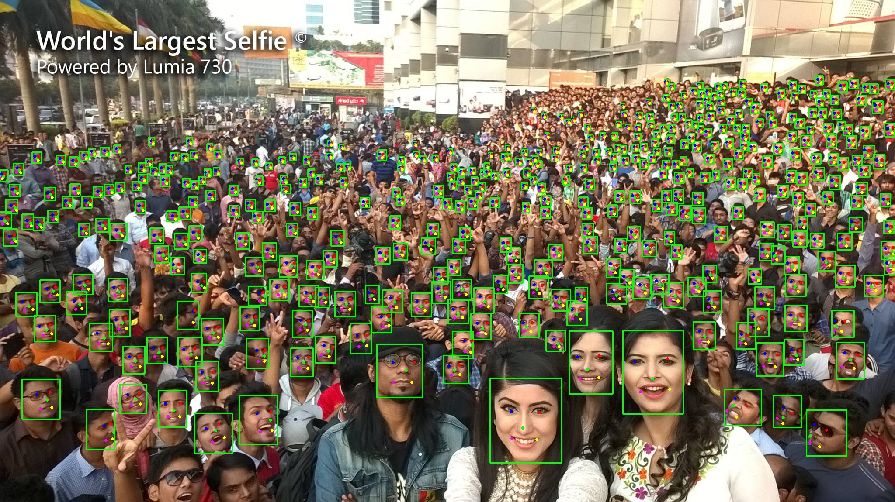
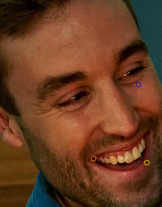
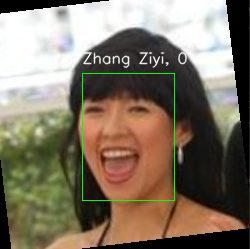
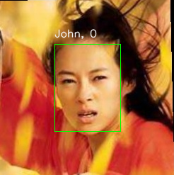

# Face Recognition

In many situations, if we want to deploy a facial recognition device to protect private areas from strangers by security doors, for example, the edge devices, limited in hardware, can make the facial recognition process slow and unreliable if using inappropriate models. 

This is my personal project where I will deploy a pre-trained `YuNet` model for face detection, pre-trained `MobileFaceNet` for facial features embedding, then retrieving in the vector database (`FAISS`). Also, set up a mechanism to add new faces without retraining the models. 

### YuNet



YuNet is a light-weight, fast and accurate face detection model, which achieves 0.834(easy), 0.824(medium), 0.708(hard) on the WIDER Face validation set.

Notes:
- Pre-trained model source: https://github.com/opencv/opencv_zoo/tree/main/models/face_detection_yunet
- Paper source: [YuNet: A Tiny Millisecond-level Face Detector](https://link.springer.com/article/10.1007/s11633-023-1423-y)

### Face Alignment

I deploy 2 methods to align images: alignment with existent tools from opencv and aligned by a Deep Learning model.

1. OpenCV

For OpenCV method, I simply rotate face that two eye points lie in the same line and resize image to base size (128x128).

Before alignment:

 

After alignment:


2. Deep Learning method

I will complete this in the future.

### MobileFaceNet

MobileFaceNet is a deep neural network model specifically designed for face recognition in mobile environments. It is an optimized version of traditional face recognition models, aiming to reduce computational resource requirements while still ensuring good performance in real-world applications, especially on mobile devices with limited memory and processing power.

Notes:
- Pre-trained model: https://github.com/Xiaoccer/MobileFaceNet_Pytorch/tree/master/model/best

### FAISS

Why FAISS? Simply, I am looking for a simple and quick database to deploy this project. Otherwise, FAISS supports many techniques for retrieving similar vectors in the large database such as Product Quantization and Inverted File Index. 

In reality, the face recognition system is usually accompanied by an admin system controlling all sub-systems with the same database. In this situation, we can use some databases which support well for distributed systems like Milvus, Pinecone,...

### Demo

First, set up your environment:

```pip install -r requirements.txt```

Add new face to database:

```python main.py```

Inference:

```python inference.py```

Result:

- Correct Answer: 



- Wrong Answer:



The inference time is about 2-3s on CPU: Intel(R) Core(TM) i3-4160 CPU @ 3.60GHz

### Future Improvement

- Replace distance calculation method in FAISS instead of L2.
- Implement other method to align image.
- Create the more friendly UI.
- Custom train detection and embedding models on custom dataset.
- Implement on more types of database.


